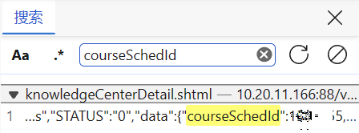
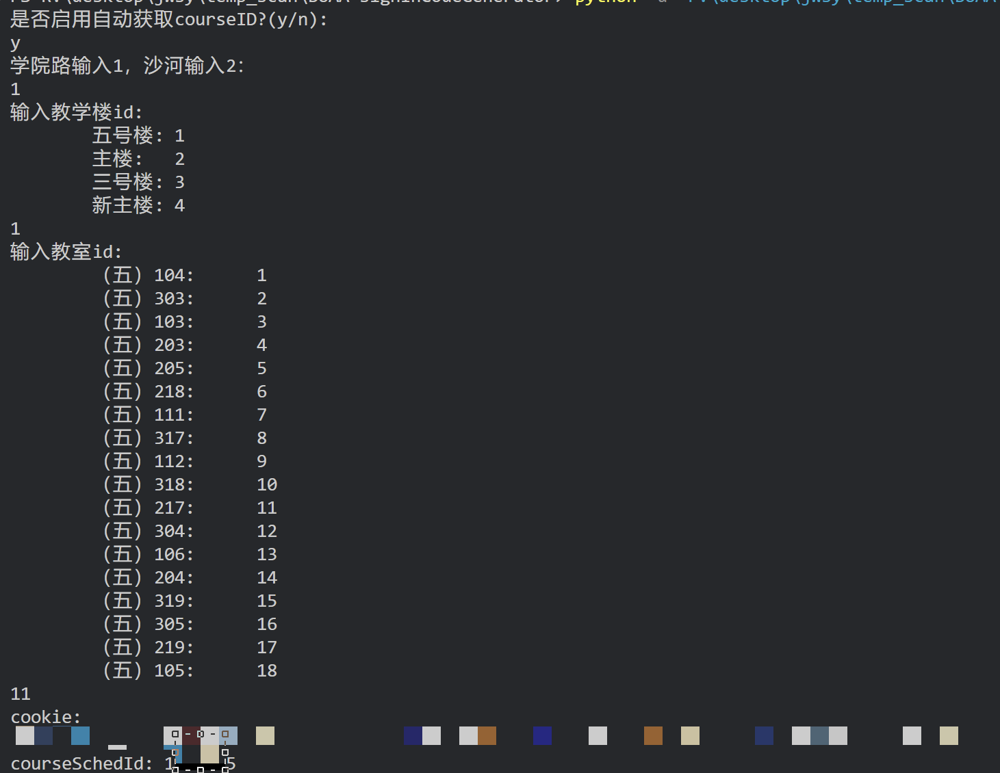

# AUBB-signInCodeGenerator
应该能用来复刻智慧教室的多动症签到二维码，实现在寝室扫码（

没签上到怒而做这个。        
众所周知智慧教室的签到二维码总是在变所以不是很适合在寝室扫别人拍的图，于是写了个可以本地生成同款二维码的东西，这样就可以手机扫电脑了！         

实现思路是通过重新填写课程id(`courseSchedId`)和时间戳生成链接对应的二维码，再用app扫码签到。其中课程id负责识别课堂，app负责识别学生。        

## 2024-5-31大更新
只需要提供学号即可生成该学号学生**当前正在进行的课程**的签到二维码。      
学号填入`getIdByStuId.py`的第6行。        
`getIdByStuId.py`中的方法实际上可以查从入学到本学期期末所有课程的courseId，本项目只做了筛选出正在进行的课，如果你有兴趣可以阅读源码或者把我盒出来和我交流（      
另，顺便写了一个[一键打卡本学期后续所有课程的脚本](https://github.com/WinterRaurant/BUAA-iClassSignIn)🤣亲测即使在课前打卡也是算正常出勤的，所以有需要智慧教室打卡的同学可以学期初弄完一整个学期的（          

### 使用方法
缺啥包装啥，没有requirements是这样的。应该只有flask、qrcodeh和bs4需要装。  
项目目录下运行`python app.py`     
用**智慧北航-智慧教室-扫一扫**扫码       

如果你试了发现不能用了请发issue告诉我，虽然告诉我了我应该也没办法修，但是我可以把库删了避免继续丢人（  

## 旧版本使用方法
旧版支持手动填写课程id和登录状态下自动获取课程id，理论上能覆盖所有时段&所有课程的签到。          
位于`v1.0.0`分支下，需要使用旧版本的功能请切换至这个分支。        

### 手动填写特定课程id
让真的在现场的同学拍照给你，用过期的二维码转链接看一下`courseSchedId`字段的值，填到`temp.py`第4行的`courseSchedId`，然后再运行本项目扫码。

### 没朋友的解决方法
课程id可从智慧教室上获取，具体方法为           
1. 进入课程回放或直播等**可以精确到课堂的**页面
2. 开发者模式，在网络（如果你看的是回放）或元素（如果你看的是直播）里搜索`courseSchedId`，把搜出来的值填到`temp.py`第4行的`courseSchedId`
   

这种方法可以手动挑选需要签到的课&节次，对对应课堂签到。

### 自动获取课程id

现支持**根据个人课表自动获取正在上课的那堂课的id**和**获取指定教室正在上课的那堂课的id**           
相当于用脚本实现了上一条介绍的查询，cookie仅用于访问智慧课堂页面。这个网站的会话过期还蛮快的，被踢出来了的话需要手动登录一下网站保持会话连接。不过重新登陆似乎是明文传输&&没有验证码的，等有缘人补自动登录部分吧（

#### ~~根据课表获取~~
~~仅需输入cookie，即可获得自己正在上课的课的签到二维码。~~
实现方法和最新版不同，但效果一样，建议使用最新版。

#### 根据教室获取
根据指引选择特定教室并提供自己的cookie，本项目可以自动获取**当前时刻该教室正在进行的课堂**的课程id，并生成这堂课的签到二维码。建议优先选择自动获取，获取失败或需要补签以往的课程再考虑手动填写。    
        

               

